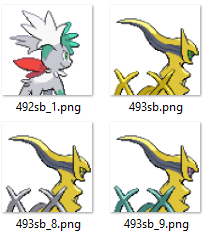

# Pokémon Files by Numbers
Makes all pokémon sprites and cries use National Pokédex number as file name instead of id, like Essentials version 18 and earlier.

## Compatibility
Doesn't work on Essentials versions older than v20.

## Installation
Follow the [Script](/Script.rb) instructions.